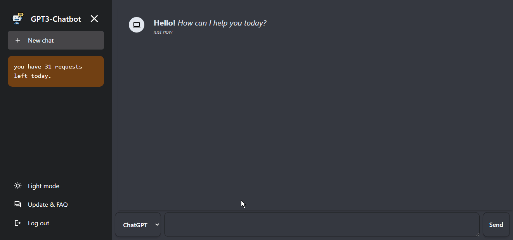

# ChatGPT clone with DALL.E image generation model

## One-Click Deploy

### Deploy to Netlify

[](https://app.netlify.com/start/deploy?repository=https://github.com/EyuCoder/chatgpt-clone)

### Deploy to Vercel

[](https://vercel.com/new/clone?repository-url=https://github.com/EyuCoder/chatgpt-clone&project-name=chatgpt-and-dalle&repo-name=chatgpt-clone)

_you can checkout the app [here](https://chatgpt.eyucoder.com/)_

> a demo of the App

<!-- https://user-images.githubusercontent.com/26358650/212903093-08c58f9b-25b5-440d-89e7-7a4b1f36df5a.mp4 -->


**Give it a ⭐ if you liked it 😜**

## If you find this project helpful, you can buy me a coffee here

<a href="https://www.buymeacoffee.com/eyuel" target="_blank"></a>

## install

```bash
npm i
```

## start app

```bash
npm start
```

**_Tech used_**

- openai API
- react
- tailwindcss
- react-icons
- react-markdown

## 📝 License © [Eyuel](https://linkedin.com/in/eyuel-daniel)

> This project is released under the Apache License 2.0 license. See [LICENSE](./LICENSE) for details.
